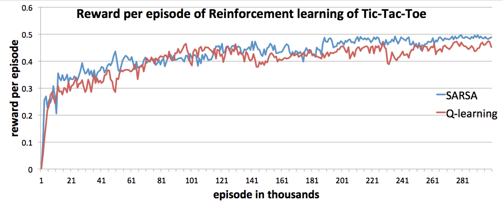

Reinforcement learning AI for the game of tic-tac-toe
-----

This project implements the SARSA and Q-learning algorithms.
The training method is to bootstrap two random agents playing against themselves.
During game play, the agents do not know nor do they need the rules and heuristics of tic-tac-toe.
For example, these agents do not know that states with only one move left is equivalent to an end game.
In fact, throughout the training process the only factors affecting the agents are:

* the definition of win and lose of tic-tac-toe, i.e. the existence of horizontal, vertical, or diagonal lines
* and the hyperparameters of the learning algorithm

The following graph shows the reward per episodes of both SARSA and Q-learning algorithms during training:

## Running this code
To run this code, run `python main.py --algo sarsa` to start a SARSA training session, and `python main.py --algo qlearning` for a Q-learning one.
For both these cases, after training, a terminal interface will be provided to play with these trained agents.

## Run tests
To run the tests of this code, run `python testing.py`.
